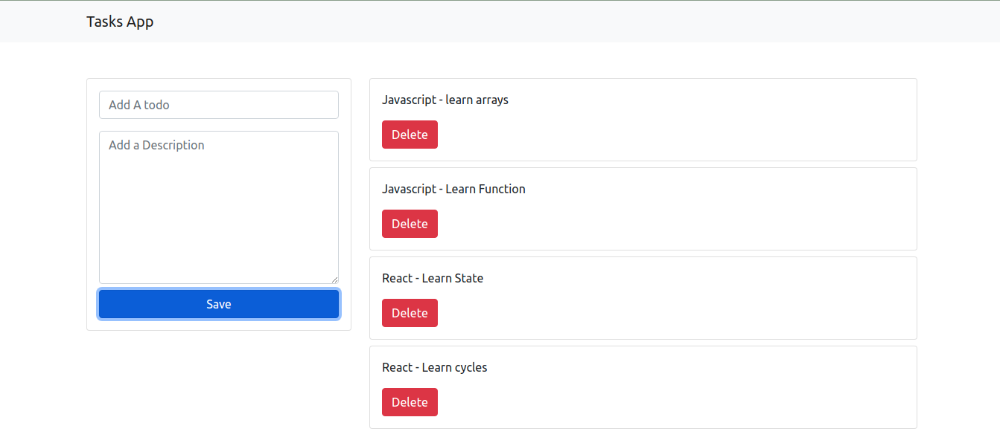

# App Tasks Javascript

## Description

Web application to add tasks and have them saved in the LocalStoraje, using:

- HTML
- JavaScript
- Bootstrap
- API to save data (LocalStorage)

---

### Test app

-[Test the application in your browser => ](https://klich1984.github.io/App-Task-JavaScript/)
---

## Screenshot

